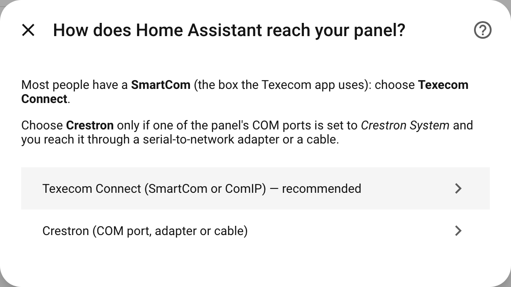
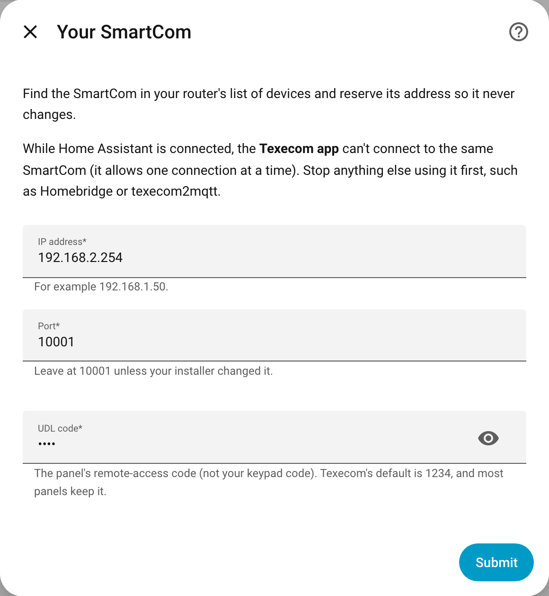
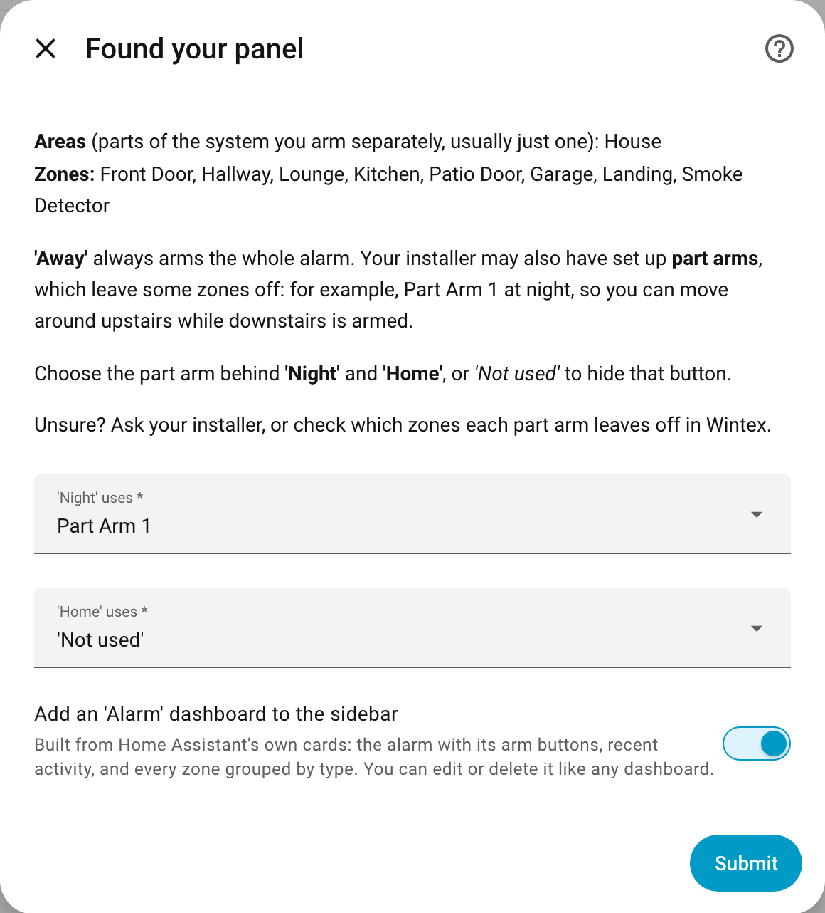

# Setting it up

This takes about ten minutes. You don't need to edit any files.

**On this page:** [Before you start](#before-you-start) · [1. Find your SmartCom](#1-find-your-smartcoms-address) · [2. Install](#2-install-from-hacs) · [3. Add the integration](#3-add-the-integration) · [4. Arm modes](#4-choose-your-arm-modes) · [5. Finish off](#5-finish-off) · [Part arms explained](#part-arms-explained) · [Coming from Homebridge or texecom2mqtt](#coming-from-homebridge-or-texecom2mqtt)

## Before you start

You need:

| | |
|---|---|
| 🏠 | A Texecom **Premier Elite** panel with a **SmartCom** (the box the Texecom app uses) or a **ComIP** |
| 🔢 | The panel's **UDL code**: its remote-access code, not your keypad code. Texecom's default is **1234**, and most panels keep it |
| 🏡 | **Home Assistant** 2025.3 or newer, with [HACS](https://hacs.xyz) installed |

> ℹ️ **The SmartCom talks to one thing at a time.** While Home Assistant is connected, the Texecom app can't connect. Your alarm works exactly as before, and the app's alarm notifications still reach your phone. If **Homebridge** or **texecom2mqtt** use your SmartCom, turn them off first.

Using a COM port set to *Crestron System* instead of a SmartCom? See [Crestron](crestron.md).

## 1. Find your SmartCom's address

Open your router's list of connected devices and find the SmartCom. Note its **IP address** (something like `192.168.1.50`).

While you're there, **reserve** that address (routers call it *address reservation*, *static lease* or *DHCP reservation*), so it never changes. If it changes later, Home Assistant loses the panel until you tell it the new one.

## 2. Install from HACS

1. Click this button, which opens HACS in your Home Assistant with this integration ready to add:

   

   (Or in HACS: **⋮ → Custom repositories**, add `https://github.com/metaljay/ha-texecom` with type **Integration**.)
2. Search HACS for **Texecom Premier Elite** and click **Download**.
3. **Restart Home Assistant** (**Settings → System → ⏻ → Restart**).

## 3. Add the integration

Or go to **Settings → Devices & services → Add integration** and search for **Texecom**.

Choose **Texecom Connect**.

Enter the SmartCom's **IP address**, leave the **port** at **10001**, and enter the **UDL code**, then click **Submit**.

Home Assistant shows **Connecting to your panel…** while it logs in and reads your panel's areas and zones. That takes about ten seconds, or **up to a minute** if something else (the Texecom app, Homebridge, a restart) was connected to the SmartCom just before. That's normal: the SmartCom waits a while before it lets a new connection in.

If it says **"Couldn't connect"** or **"The panel refused the UDL code"**, see [Troubleshooting](troubleshooting.md#setting-up).

## 4. Choose your arm modes

Home Assistant shows what it found: your **areas** (usually just one) and your **zones**.

- **'Away'** always arms the whole alarm.
- **'Night'** and **'Home'** each use one of the panel's **part arms**, which arm only some zones. Choose which part arm each uses, or *'Not used'* to hide that button. Not sure? See [Part arms explained](#part-arms-explained).
- Leave **Add an 'Alarm' dashboard to the sidebar** ticked.

Click **Submit**. That's it 🎉

Your area (named by your installer, e.g. *House*) is now **the alarm**: a device called *House Alarm*. The panel itself appears as *Premier Elite 24 panel* (with your panel's size), and each zone is its own device.

## 5. Finish off

- 🏷️ **Rooms.** Zones whose names match a room you already have go in that room by themselves: a zone called *Kitchen* or *Kitchen PIR* goes in *Kitchen*, and *Lounge* goes in *Living Room* if that room has *Lounge* as an alias. Put the others in a room from their device page.
- 🔁 **How a zone shows.** Doors, windows, smoke and gas are worked out from the zone's name and type; everything else shows as motion. To change one, open it and use **⚙️ Settings → Show as**.
- 🍏 **Apple Home**: see [Apple Home](apple-home.md).
- ⚡ **Arm automatically when everyone leaves**, and other ideas: see [Automations](automations.md).

## Part arms explained

Besides a full arm (**Away**), your panel can have up to three **part arms**, each arming only some zones. Your installer chose them, so they differ from home to home:

| Part arm | Might arm | Good Home Assistant button |
|---|---|---|
| Part Arm 1 | Downstairs only, so you can move around upstairs at night | **Night** |
| Part Arm 2 | Just the garage, or the doors and windows | **Home** |
| Part Arm 3 | Often not set up | (none) |

**Find out what yours cover** (ask your installer, or look at the part-arm settings in Wintex), then give Night and Home only the part arms you actually use. A part arm nobody set up may arm nothing useful, or the wrong zones.

When the panel is part armed from the keypad, Home Assistant shows the mode you matched to that part arm. A part arm you didn't match shows as *Home*.

You can change these later in **Configure** (see [Options](using.md#options)).

## Coming from Homebridge or texecom2mqtt

- **Turn the old one off first** (disable the Homebridge Texecom plugin, or stop texecom2mqtt): they can't share the SmartCom with Home Assistant.
- **Nothing needs copying across.** Zones, names and areas come from the panel. Choose the same Night and Home part arms you had.
- **Apple Home**: expose the alarm through Home Assistant's HomeKit Bridge. It appears as a new accessory, so set its room and notifications again. See [Apple Home](apple-home.md).
- **Apple Home automations** that armed or disarmed the alarm (for example from a switch that follows who's home): move the arming into Home Assistant (see [Arm automatically when everyone leaves](automations.md#arm-automatically-when-everyone-leaves)) and delete the Apple Home ones, so the two don't fight.

---

[← Back to the README](../../README.md) · [Using it →](using.md)
