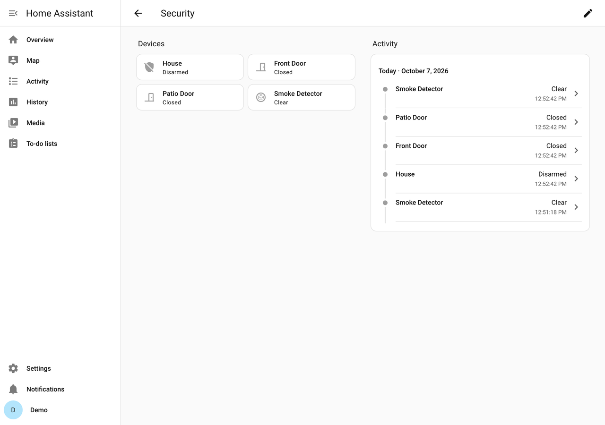
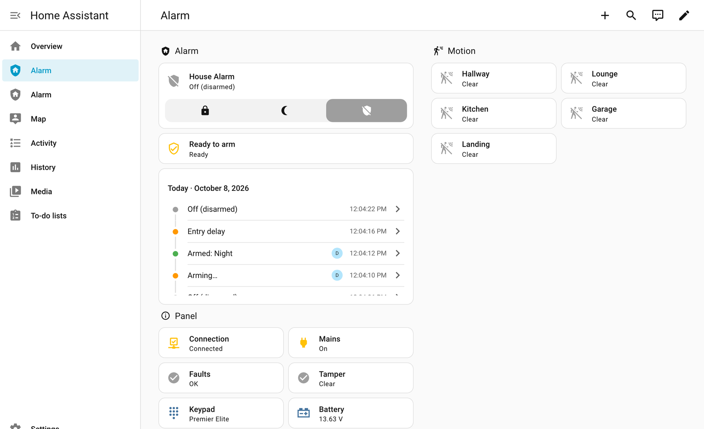
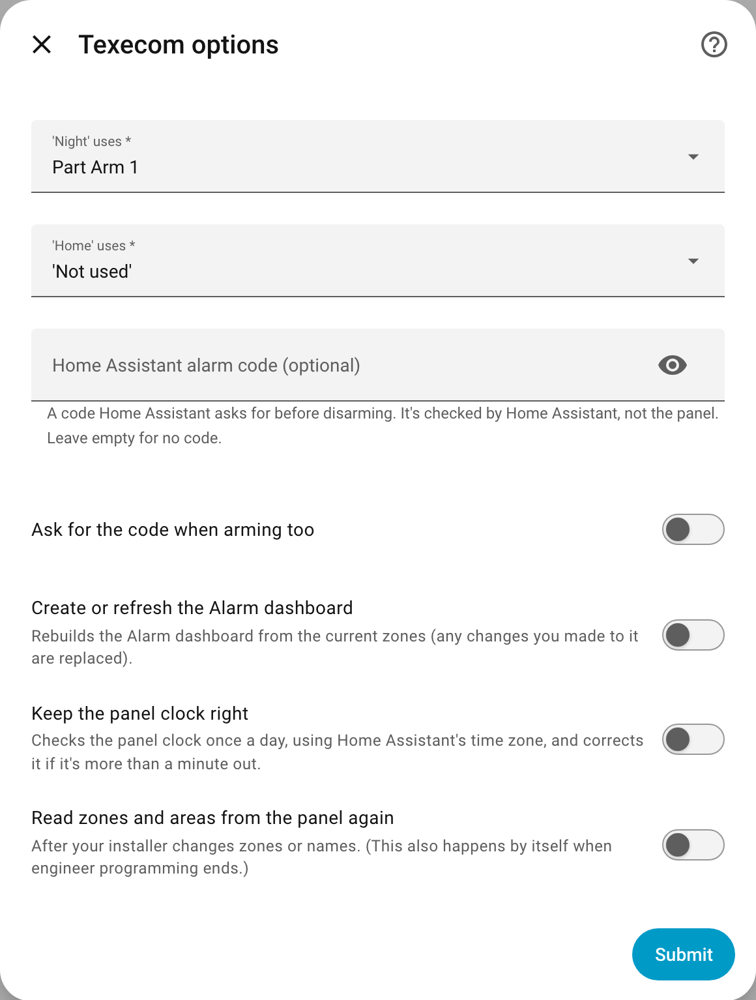
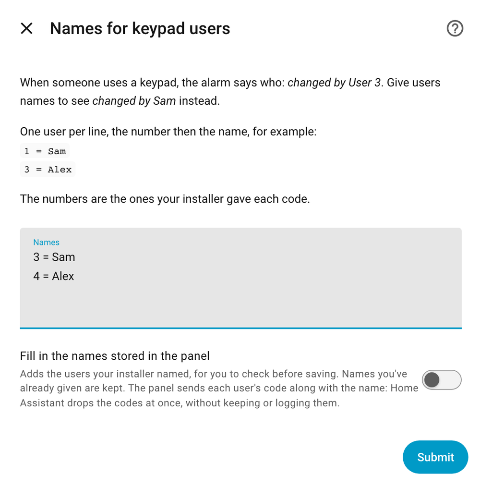
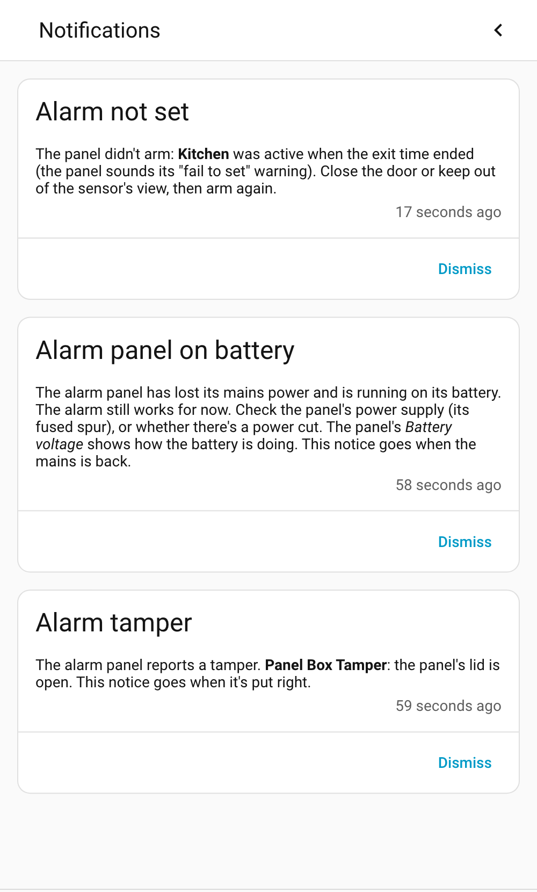

# Using it

**On this page:** [What you'll see](#what-youll-see) · [The alarm](#the-alarm) · [Ready to arm](#ready-to-arm) · [The Alarm dashboard](#the-alarm-dashboard) · [Options](#options) · [Notifications](#notifications) · [The activity list](#the-activity-list) · [Codes](#codes) · [Good to know](#good-to-know) · [Build the dashboard yourself](#build-the-dashboard-yourself)

## What you'll see

| Device | What it has |
|---|---|
| **House Alarm** (one per area, named after it) | The alarm: arm and disarm, and its state. **Ready to arm** says whether it would set now |
| **Premier Elite 24 panel** (your panel's size) | **Panel connection**, **Mains power**, **Problem**, **Tamper**, **Keypad display**, battery and panel voltages (current readings are there too, switched off until you want them) |
| One device per zone, e.g. **Front Door** | Whether the zone is open or sees movement. Each also has a **Tamper** sensor, switched off until you want it |

Entity IDs start with `texecom_`, e.g. `alarm_control_panel.texecom_house` and `binary_sensor.texecom_front_door`, so they're easy to find. They don't change if you rename things in Home Assistant.



Home Assistant's own **Overview** picks the alarm up as well: its **Security** summary lists the alarm, doors and smoke detectors, and each room shows its zones.

## The alarm

| State | Means |
|---|---|
| **Off (disarmed)** | Not armed |
| **Arming…** | The exit delay: leave now |
| **Armed: Away** | Fully armed |
| **Armed: Night** / **Armed: Home** | Part armed (see [Part arms explained](setup.md#part-arms-explained)) |
| **Entry delay** | Someone came in: disarm now |
| **Alarm!** | The alarm is going off |

- **Changed by** (on the alarm's details) says who or what did it: *Home Assistant*, a keypad user (*User 3*, or their name if you [gave them one](#options)), or for an alarm, the zone that set it off (*Kitchen*).
- **Arms and disarms at the keypad** show straight away.
- **Switching mode** (for example Night to Away) shows *Arming…* while the panel switches over; you won't see *Off* in between, so automations that run on *Off* don't fire.

## Ready to arm

**Ready to arm** (on the alarm's device, and on the Alarm dashboard) says whether the panel would let the alarm set right now:

- **Ready**: nothing is open that would stop it.
- **Not ready**: something is. Its **open zones** (in the sensor's attributes) list what's open, e.g. *Front Door*.

It's the panel's own answer, checked a moment after doors and sensors change while the alarm is off. Texecom Connect only.

## The Alarm dashboard



If you left the box ticked during setup, **Alarm** is in the sidebar: the arm buttons, **Ready to arm**, the last day's activity, panel health and every zone grouped by type. It's built from Home Assistant's own cards, so you can edit it like any dashboard.

To build it again (for example after adding zones), use **Configure → Create or refresh the Alarm dashboard**. That replaces any changes you made to it.

## Options

Open **Settings → Devices & services → Texecom → ⚙️ Configure**, and pick what to change:



| In the menu | What it does |
|---|---|
| **Night and Home buttons** | The part arm behind each button. *'Not used'* hides the button. *Reconnects to the panel* |
| **Home Assistant alarm code** | Optional. Home Assistant asks for it before disarming (and, if you tick the box, before arming). It's checked by Home Assistant, not the panel, and has nothing to do with your keypad codes. **It stops Apple Home and some automations working**: see [what a code affects](#what-a-home-assistant-alarm-code-affects) first |
| **Names for keypad users** | One per line, like `3 = Sam`: the alarm then says *changed by Sam* instead of *User 3*, here and in the activity list. With a SmartCom or ComIP, tick *Fill in the names stored in the panel* to start from the names your installer gave (the engineer code, user 0, is filled in as *Engineer*). The panel sends each user's code with the name; Home Assistant drops the codes at once, without keeping or logging them |
| **Notifications** | Whether Home Assistant shows a notification while the panel has no mains power, or while a tamper is open (both on to start with) |
| **Panel clock** | **Keep the panel clock right**: once a day (and on connecting), sets the panel's clock if it's more than a minute out, in Home Assistant's time zone (so British Summer Time is handled). *Reconnects to the panel* |
| **Read zones and areas from the panel again** | After your installer adds or renames zones. It happens by itself when engineer programming ends, too |
| **Create or refresh the Alarm dashboard** | Builds the dashboard again from the current zones (it asks first, because any changes you made to it are replaced) |



To change the SmartCom's address or the UDL code, use **⋮ → Reconfigure** on the same page.

> Settings marked *reconnects to the panel* take up to a minute to apply, because the SmartCom waits a while before it lets Home Assistant back in. Everything else applies straight away.

## Notifications

Besides the **Alarm not set** notification (the alarm couldn't arm because a zone was still active), Home Assistant shows:

| Notification | While | Goes when |
|---|---|---|
| **Alarm panel on battery** | The panel has lost its mains power | The mains is back |
| **Alarm tamper** | A tamper is open, with what to check (e.g. *the panel's lid is open*, or *a detector's cover is open*), or the panel has set off its internal sounders without saying why (*Internal Alarm*) | It's closed again (*Internal Alarm*: a code has been entered at the keypad) |



Turn either off in **Configure → Notifications**. These appear in Home Assistant itself; to be told on your phone, see [Automations](automations.md#tell-me-about-the-alarm-on-my-phone). All three need **Texecom Connect**: a [Crestron](crestron.md) connection doesn't report them.

## The activity list

The alarm's activity (on its page, in the **Logbook**, and on the Alarm dashboard) shows what happened in plain words, for example:

- *House Alarm was set off by Kitchen*
- *House Alarm didn't arm: Front Door was active when the exit time ended*
- *House Alarm reported a tamper: Panel Box Tamper*
- *House Alarm reported a fault: AC Fail*
- *House Alarm keypad used by Sam (a code)*

With [Crestron](crestron.md) you see the keypad users; the rest needs **Texecom Connect**.

## Codes

- **The UDL code** lets Home Assistant talk to the panel. It's stored in Home Assistant like any integration's password. Anyone with admin access to your Home Assistant can arm and disarm, so keep that access tight.
- **The Home Assistant alarm code** (optional, in Options) is an extra check on top: Home Assistant asks for it before disarming. It's a code you make up; the panel never sees it.
- **Your keypad codes** aren't used or stored by Home Assistant.

### What a Home Assistant alarm code affects

| | No code (the default) | With a code | With a code, and *Ask for the code when arming too* |
|---|---|---|---|
| Home Assistant's dashboards and app | Arm and disarm freely | Asks for the code to disarm | Asks for the code to arm and disarm |
| The Home app and Siri (through HomeKit Bridge) | Arm and disarm | **Can't disarm** | **Can't arm or disarm** |
| Automations, scripts and the [blueprints](automations.md) | Arm and disarm | Arming works; disarming needs `code:` in the action | **Arming fails too**, including *arm when everyone leaves* |
| The keypads, fobs and the panel itself | Unchanged | Unchanged | Unchanged |

The Home app can't ask for a code, and HomeKit Bridge only passes one on if it's written into its YAML settings (`entity_config` → `code`); a bridge set up from **Settings → Devices & services** can't hold one.

**Our suggestion:** if you use Apple Home or the arming automations, leave it empty. Anyone who can open Home Assistant has to log in first, so keep that login (and who has an account) tight instead.

## Good to know

- 🚨 **When the alarm goes off**, the panel drops the connection for about a minute to send its own alarm report through the SmartCom. The alarm and zones **keep showing their last state** (e.g. *Alarm!*) meanwhile, so dashboards and the Home app don't go blank; **Panel connection** shows the link itself. Home Assistant reconnects and catches up by itself.
- 🔁 **It reconnects by itself** after a power cut, a router restart or a dropped connection, and reads the panel's state again so nothing is missed. After Home Assistant restarts, the SmartCom can take about a minute to let it back in.
- 🔌 **Mains power** turns off as soon as the panel reports a mains failure, and **Problem** lists any fault the panel reports (e.g. *AC Fail*, *Low Battery*). The panel doesn't report the mains coming back, so Home Assistant checks the power readings every 30 seconds instead.
- 🔧 **Tamper** turns on while the panel's lid, a keypad, the bell box or a detector is open, and says which. Most installs wire every detector's tamper switch to one shared circuit, so it can't say *which* detector: that shows as *Auxiliary Tamper*. The panel doesn't always report a tamper: if it sets off its internal sounders while the alarm is off and doesn't say why, Tamper shows *Internal Alarm* until a code is entered at the keypad.
- 🕐 **The panel clock** resets if the panel loses all power (mains and battery). Home Assistant notices and offers to fix it (see [Troubleshooting](troubleshooting.md#the-panel-clock-is-wrong)).
- 📟 **Keypad display** shows what the keypads say (e.g. *System Alerts!*), without the clock.

## More than one area

If your panel has more than one area (the house and a garage, say), each gets its own alarm and **Ready to arm**, armed and disarmed on its own. *Changed by* and the zone that set an alarm off are worked out for each area, and **Alarm not set** stays until the area that didn't arm is armed. The **Night** and **Home** buttons use the same part arms in every area. Over [Crestron](crestron.md), only the first area can be part armed.

## Build the dashboard yourself

The ready-made dashboard only uses built-in cards. If your Home Assistant can't create it (the option shows an error), add a dashboard, open **⋮ → Raw configuration editor**, and paste this, changing the entity names to yours:

```yaml
views:
  - title: Alarm
    type: sections
    sections:
      - type: grid
        cards:
          - type: heading
            heading: Alarm
            icon: mdi:shield-home
          - type: tile
            entity: alarm_control_panel.texecom_house
            vertical: false
            features_position: bottom
            features:
              - type: alarm-modes
                modes: [armed_away, armed_night, disarmed]
            grid_options:
              columns: full
          - type: logbook
            target:
              entity_id: alarm_control_panel.texecom_house
            hours_to_show: 24
      - type: grid
        cards:
          - type: heading
            heading: Zones
            icon: mdi:motion-sensor
          - type: tile
            entity: binary_sensor.texecom_front_door
          - type: tile
            entity: binary_sensor.texecom_hallway
```

---

[← Setting it up](setup.md) · [Apple Home →](apple-home.md)
